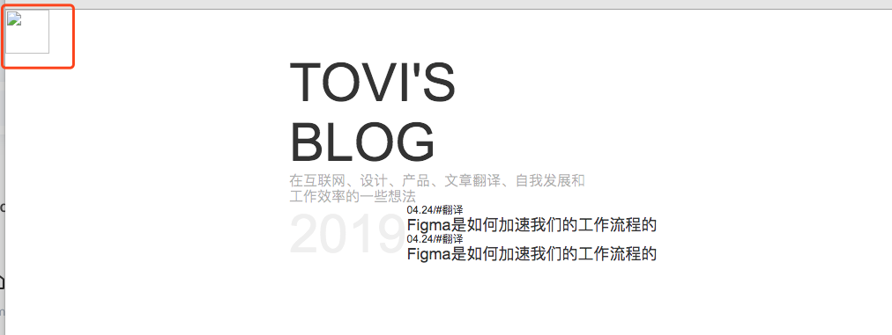
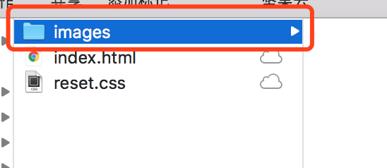
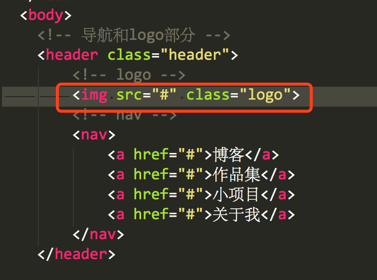
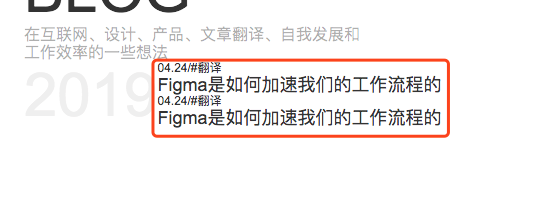
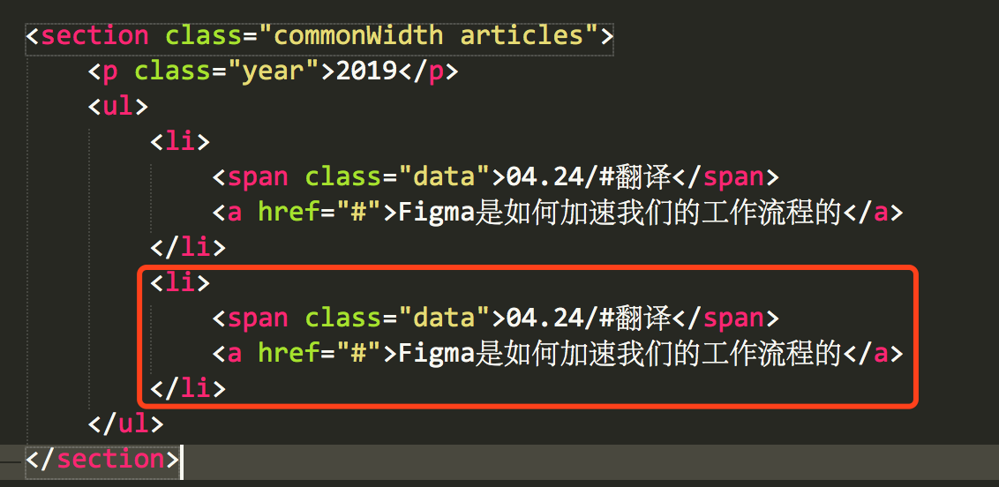

# Day 001: 图片添加、修改文案和检查
> Date: 2019.05.20  
> By Liudy  
> [返回 README](README.md)
  

## 1.将logo图标添加到页面中，如图所示：

使用过程：
1. 将logo图片放到images的文件里;
   

  
1. 在index.html文件里找到如下位置：将src里面的#去掉，然后写成你的图片路径，格式举例：
   ``
  
    > 说明：  
    > ./表示当前目录  
    > ../表示上一级目录  
    > 如果是上两级目录： ../../  

  
## 2.添加你想要的文章名称和日期等内容：如图所示

使用过程：
在index.html文件中复制粘贴如下代码，并修改里面的内容

  
## 3.需要了解的样式调试方法如下：
   1. 通过在代码里直接添加边框来定位你想要修改的位置：
   <a href="day1/v1.mp4" target="blank">查看</a>

   1. 通过浏览器的审查元素方式来定位你想要修改的位置：
   <a href="day1/v2.mp4" target="blank">查看</a>