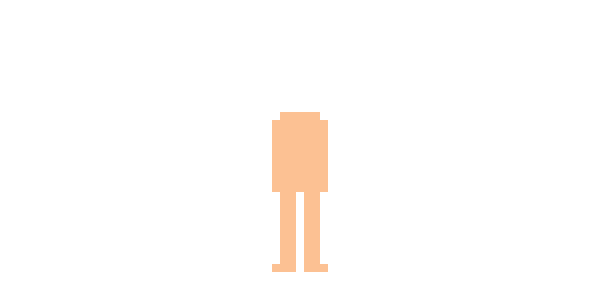
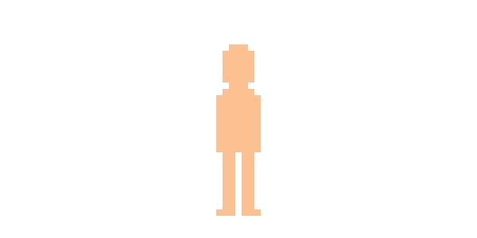
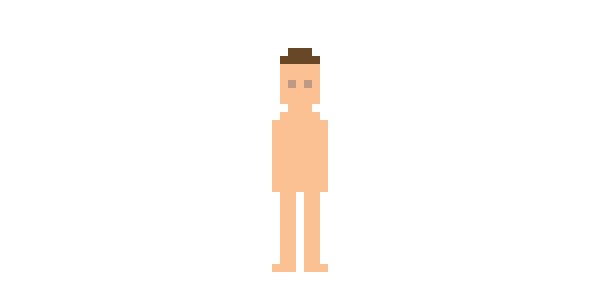
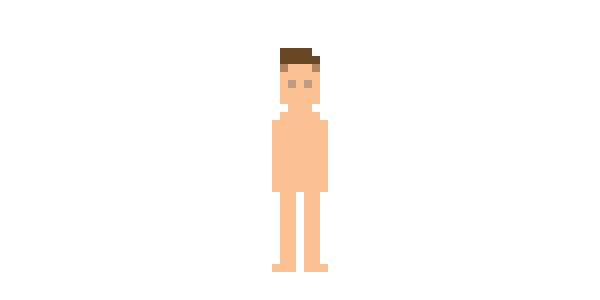
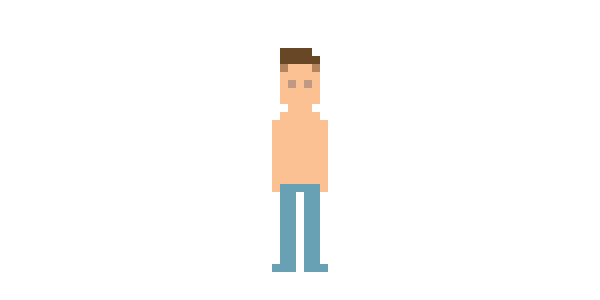
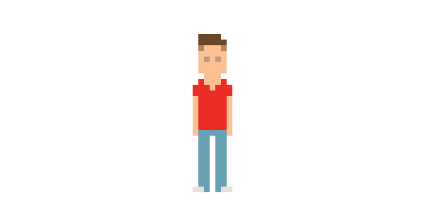
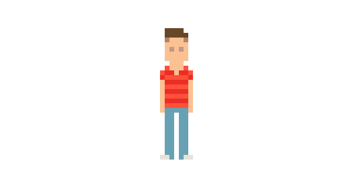
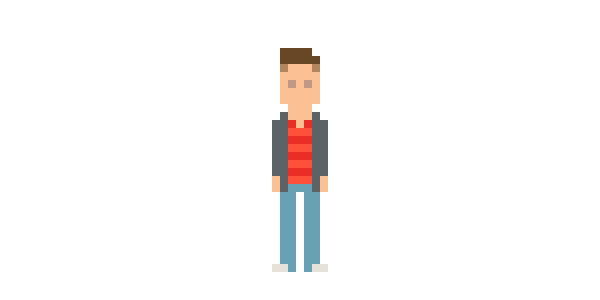
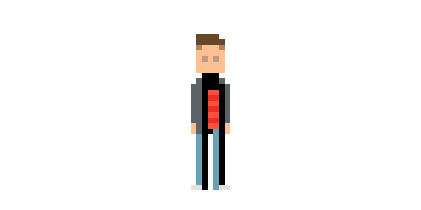
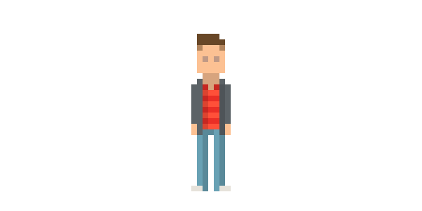

# 如何绘制像素风格人物

Date: 2016-05-04 10:46

> 最近特别热衷看国外的一些关于UI设计的博客/网站，因为我遇到了一个特别好的Chrome插件—— [Muzli](http://muz.li/) ，它可以把当下最流行的文章集合到 Chrome 浏览器的启动页，当我每次打开浏览器总能看到质量非常高的或是来自 Medium 的文章，或是来自 Dribbble 的美好图片，或是来自 DesignerNews 的讨论，或是来自 Youtube 的视频。
>
> 然后就特别感叹国外的设计风格引领潮流，每天总是出现太多的美好东西，比如谷歌的 [Materail Design](http://www.materialup.com/)，比如最近比较兴的 [MBE 风格](https://medium.com/muzli-design-inspiration/dribbble-trend-mbe-styled-8ae5a3e28ec0#.ypi2f1sit)。
>
> 自从把Muzli设置成Chrome启动页之后，基本上每天都能浏览几篇质量很高的英文文章。所以，我就想把看到的一些文章翻译出来并发到这个博客，这样能够给博客填充点内容不说，还能提高英语阅读能力。
>
> 下面请看，靠着渣英语水平强行翻译的第一篇文章：

> 如果你想要绘制像素风格图，可以先绘制最基本的**人物角色**开始。
在这篇教程中，我们将绘制一个极其简单的人物角色。不过虽然他很简单，但是其中也是包含了许多的细节，把它们用来做自己的头像是挺不错的用法，或者你也可以用这个方法去画出你喜欢的电影电视人物/名人。

## 1. 绘制人物的身体

一般来说我会建议从头部开始画，在这里也是一样，但是考虑到这个人物角色如此简单，他的比例比较逼真，从身体部分开始画也是比较好的。

首先我们在Ps中新建一个**长宽100px画布**，这个人物我画的是28px高的。

### 第1步

确定皮肤的颜色。在这里，我选择的是：**明度25°**，**饱和度40%**，**亮度98%** (#fac096)，但是也不是一定要用这个颜色，你可以选择你喜欢的合适的皮肤颜色。

### 第2步

我们将全程使用**1像素**点的**铅笔工具**在放大到合适比例（比如800%）的画布上来绘制。

接着我们用刚才调的颜色画出两条腿，**2像素**的腿之间有**1像素**的空白，通常这样画是比较好的，除非你想要画一个胖乎乎的人。

这两条腿的形状可以帮我们规范身体的其他部分。

你可能想试试其他的比例，来找到你喜欢的，而不是仅仅跟着我的步骤来。但是如果你想要画出来的人物跟我的一样，那么上图中的腿和躯干的长度都画成**9像素**高。

### 第3步

添加两只手臂来画完四肢，它们只是在躯干旁边画一竖平齐的像素。同时在两条腿的底部画多一行像素，记得在两边点多一个像素作为脚掌

接着在躯干的上面画多一行像素作为肩膀，手臂的上面少画一个像素看起来有点奇怪，但是它让肩膀看起来像是圆的，也因此变得更自然一些。

### 第4步

最后画一个带圆角的头。我画的头是和躯干一样宽的5像素，**7像素**高。

## 2. 添加面貌特征

虽然我们画的人物非常小，但是我们还是可以给它加上一些细节。

### 第1步

脸上仅仅能够画两只眼睛了。

我画的眼睛稍稍比皮肤暗一点（**明度大概暗15%**）。我不想让眼睛反差太大，我也不认为这么小的分辨率上我们能看到眼睛的颜色。

### 第2步

添加头发。这里我画的是深棕色的头发遮在头上，然后再添加一行让头长一点点，因为有头发。

### 第3步

在头的两边用比深棕色淡一点点的颜色来添加头发，让它看起来好像比较短，同时有抗锯齿的作用。这个颜色是通过将上一步的深棕色的**透明度**降低到**50%**得到的（50%的透明度的快捷键可以按数字”5“），画好后记得把透明度调回100%。这样这个人物好像就有一个头发往后梳的飞机头了。

## 3. 添加衣服

衣服上是我们可以做多自定义的地方。因为我们画的这个像素画的风格没有画描边占地方，所以即使这个角色很小也能够添加许多细节。

### 第1步

给人物画上裤子，使用低饱和度的海蓝宝石色来代表蓝色牛仔裤。如果想尝试一下不同的颜色，我通常会**复制**当前在上色的地方到新的一个图层，然后打开**色相\饱和度\明度**面板（**图像>调整>色相\饱和度**…），然后移动滑块来选择喜欢的颜色。

### 第2步

画上鞋子。已经没有太多的空间来给鞋子添加太多细节了，我给他画上一双接近白色的运动鞋，但我不会用纯白色的，因为我打算用白色作为背景。可以发现不使用描边风格的不好的一点是，如果人物上的一些颜色和背景色一样，就会丢失一些细节。

### 第3步

给人物画一觉衬衫。衣服的颜色和裤子的颜色要搭一些。然后衣服我是画成V领短袖的。

### 第4步

就像我前面说过的，你可以在衣服上添加许多的细节——可以画一条领带，可以在衣服中间画一个图案。我给它画了一些低对比度的条纹。

### 第5步

最后再添加一层衣服：一件夹克。如果你喜欢，你也可以给人物添加一些配饰，比如项链、手表、耳机等等。

## 4. 给人物添加阴影

现在人物和衣服细节都已经完成了，接着添加少许的阴影来增加人物的立体感。

### 第1步

**新建一个图层**，然后在里面画上黑色的阴影。
其中的一些阴影对应头在颈部和夹克在衬衫上形成的阴影。其他的就是传达人物的厚重感，腿不是扁平的，所以给一边添加阴影来添加分量，躯干的右边也是一样的道理。

两只手臂的话就太细了，就不用添加阴影了。

### 第2步

**降低图层的透明度**到15%左右来应用阴影。你可以在图层面板中找到这个操作，或者在当移动工具选中的情况下按键盘上的15。

最后，你可以**向下合并**图层（**图层>向下合并**）并导出你的作品。

在100%的视图下，这个人物看起来可能太小了以至于没办法欣赏。你可以选中并复制它，然后放大到200%或300%（编辑>自由变形），记得把插值改为**临近**

最后，保存成PNG或GIF就大功告成了。

## 太棒了，终于完成了

恭喜你，你坚持到了这里，完成了这个像素画教程。

当然，现在你可以尝试画一些类似这样的图了，或者你可以画你喜欢的乐队，或者是你喜欢的电视电影人物，又或者画你的朋友，哈哈。

***

### 参考链接

1. 原文地址：[How to Make Pixel Characters](http://design.tutsplus.com/tutorials/how-to-make-pixel-characters--cms-26263)
