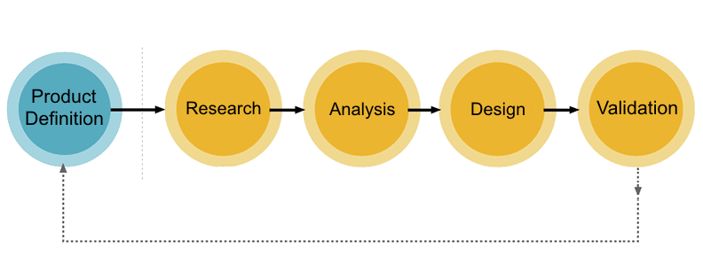
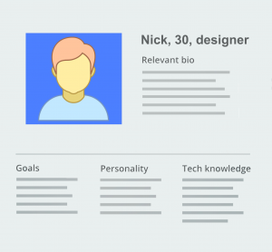
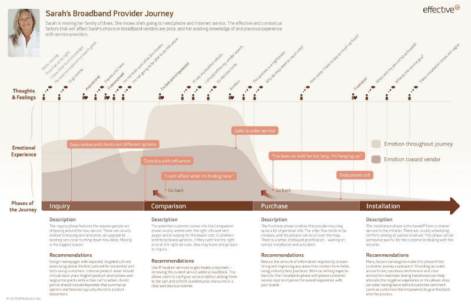
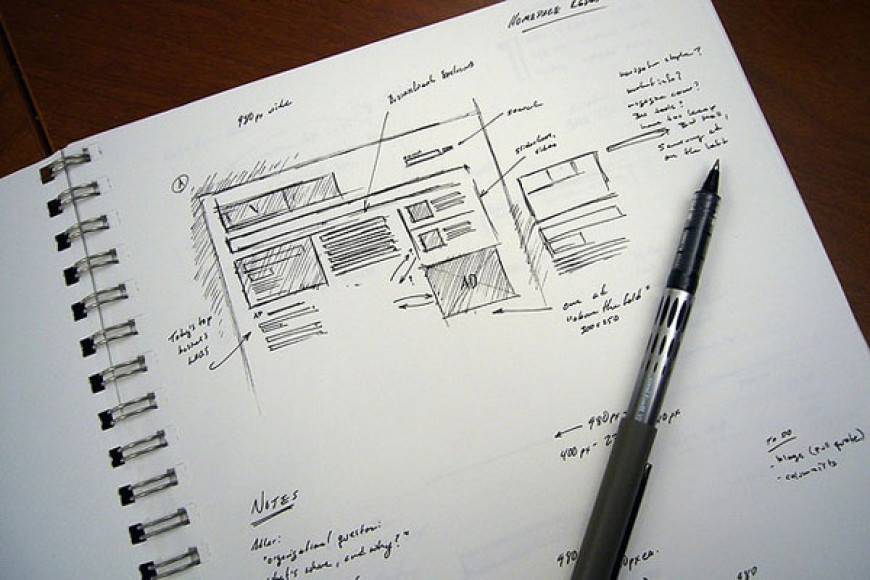
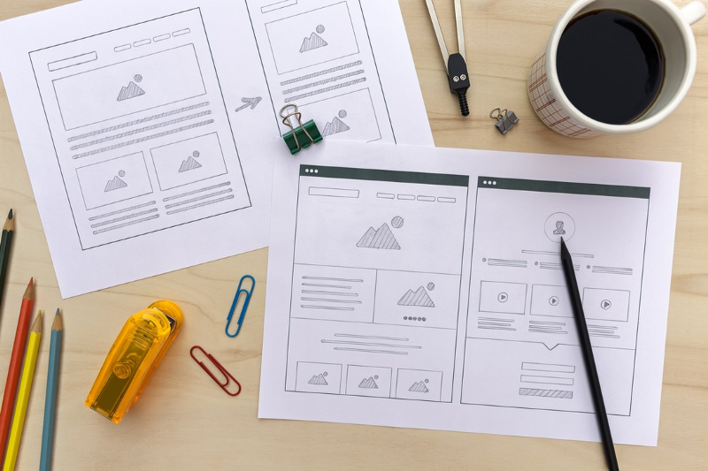
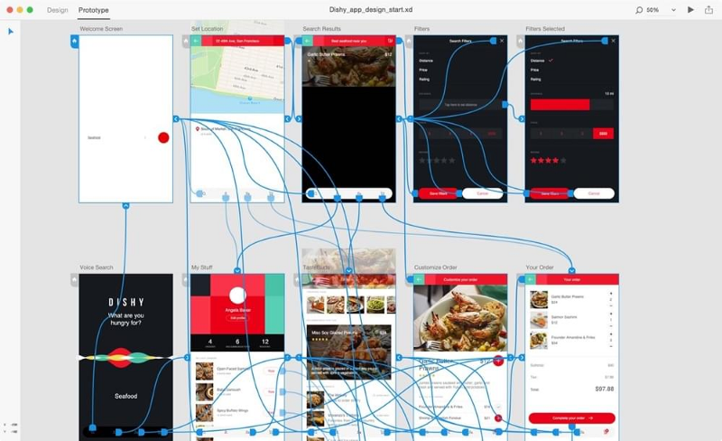
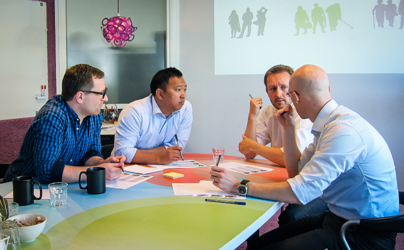

# 用户体验设计流程

## 背景

作为一个用户体验（UX，下文都用UX表示用户体验）设计师，我想你应该问过自己这样的一些问题：

- 用户体验设计的流程应该是怎样的？
- 流程有哪些具体的步骤？

这些问题之所以这么多人问，有这么一个简单的原因：对UX设计来说，设计流程可谓是基础，从某种程度上来说可以决定一个设计的成败。如果没有一个良好的UX设计流程，设计师基本上可以说是在黑暗中前行，摸不着方向。而如果有一个简洁清晰的UX设计流程，打磨出令人惊艳的设计作品的可能性将大大提升。

在这篇文章中，我们将会定义一个通用的UX设计流程，以及应该采取某个具体设计阶段的顺序。我们还将看到在各个阶段可以使用的方法。

## UX设计流程包括哪些步骤？

对于这个问题，我的回答是：看情况。

在UX设计领域，UX设计流程每个设计师都有的，但是每个设计师的流程都不一样，或简单或复杂，或高效或繁琐。之所以这样，是因为设计项目的不一样导致流程的不一样。不用的项目需要不同的方法，比如网页设计和移动应用设计的流程就不完全一样。同时对于每一个项目，都有一些UX设计师应该遵循的*经验共识*(比如在设计原型之前要进行用产品调研)。针对具体的项目的每个设计流程，流程还可能需要定制。

## 设计流程概览

如果非要总结出几个设计流程的核心阶段，每一个UX流程应该包括以下5关键阶段:

### 1. 产品定义

在UX设计中，产品定义是最重要的阶段之一，是每个设计流程一开始就应该要做好的，在你设计产品之前，你应该先思考它存在的意义。一个好的产品定义，可以为产品的成功打下坚实的基础。在产品定义这个阶段，UX设计师需要跟利益相关者（比如你的同事和老板）从最高的视野上对产品进行头脑风暴，想出产品最根本的概念。

这个阶段通常包括：

- *利益相关者面谈：* 通过与参与项目的关键人物面谈，来了解收集他们的目标。定义你们将要设计的产品的目标和价值，是这个以结果为导向的流程的关键推动力。
- *建立价值主张：* 价值主张可以定位出产品的几个主要问题：是什么产品？是给谁用的？何时何地使用？价值主张可以帮助团队的所有成员，对于将要设计什么产品达成一致的见解。
- *画出产品大概的草图：* 画一下团队将要设计的草图。
- *项目启动会议：* 项目启动会议集结了所有的关键成员，来为团队和其他利益相关者设立恰当的期望。它涵盖了产品目标的基础大纲，谁来设计和开发产品，成员如何共同合作，以及利益相关者的期望（比如KPI和如何衡量产品是否成功）。

### 2. 产品调研

一旦定义了产品，产品调研（自然包括用户和市场调研）将会为伟大设计的诞生奠定另一半的基础。在设计的早期阶段，良好的调研报告可以传递许多信息，可以为你节省大量的资源（时间和金钱），因为这样以后产品不用进行过多的调整。

产品调研可能是项目中变数最多的阶段，因为它会根据产品的复杂性、时间、可用的资源和许多其他的因素而变化。这个阶段通常包括：

- *个人深度访谈：* 一个伟大的产品体验从对用户的良好了解开始。UX设计师不仅要请出用户是谁，而且要深入理解他们的需求、他们的恐惧、他们的动机以及他们的行为。
- *竞品调研：* 对竞争对手的产品进行综合分析，用比较可比的方式分析出他们的已经有的功能。调研有助于UX设计师理解行业标准，产品和在这个领域里到底还有没有机会。

### 3. 分析

在这个分析阶段的主要目的是，从产品调研阶段中收集的数据里，获得一些可用的东西。在用户『想要和需要』里，捕获、组织和推断，可以帮助UX设计师开始理解『用户为什么想要和需要』。在这个阶段，设计师可以证明某些重要的假设是成立的。

这个阶段通常包括：

- *设计用户画像：* 用户画像是虚构的人物，用来代表可能会用类似方式使用产品的，几种不同类型的人。目的是为主要的用户创建可靠而且接近现实的表现形式。

- *创建体验地图：* 体验地图是从用户视角来理解他们是如何与产品交互的一个很重要的工具。体验地图是用简单的插图来表示产品的用户使用流程。一个基本的体验地图可能仅仅体现一个用户路径（一个用户、一个目标、一个脚本），即使可能产品又许多其他的路径。

### 4. 设计

当产品的体验地图创建好之后（清楚了用户的目标和他们喜欢的交互），设计师就开始设计了。一个高效的设计阶段应该包括高效的合作（它需要所有设计团队成员不断地输出，参与影响产品开发）和持续的迭代（意味着需要经常循环地验证想法和猜想）。

设计阶段通常包括：

- *画草图：* 画草图是把点子视觉化最简单的方式，也是把一个概念视觉化最快的方式。在决定用某一个解决方案之前，画草图允许设计师先画出一系列的解决方案。

- *画线框：* 线框是表现页面结构（层级和关键元素）的视觉引导，同时也作为产品的基础主干——设计师经常用来作为视觉稿的骨架。

- *制作原型：* 如果说线框是表示结构和视觉层级的（外观上），那么原型就是体现在其基础上的交互体验（外观和感觉上）。原型通常使用可点击的线框图来模仿真实的产品体验。

- *制作设计标注：* 设计标注通常包括写着产品的功能和样式需求的用户流程和任务流程表。它描述了功能的流程和包含了切图资源，来给开发工程师使用。

### 5. 验证（测试）

通常来说，测试阶段在高保真的设计稿刚出来的时候就要开始了，和利益相关者与最终用户使用一系列的测试方法来测试。

和产品调研阶段类似，测试阶段也是根据项目的不同而不同。它通常包括：

- *吃自己的狗粮：* 一旦产品迭代到可用的阶段，产品团队自己来测试是一个很节省产品的方法。

- *用户测试：* 用户测试通过真实用户来测试验证产品设计。用户测试有大把的表格可以使用，有一些非常流行的表格包括：可用性测试、焦点小组、beta 测试、A/B测试以及调研。

- *创建用户日志：* 用户日志是捕获来自真实用户信息的好方法。设计师可以使用Google Docs 来创建简单的模板和灵活的问题：你通常在哪里使用产品？你希望完成什么任务？有什么问题令你很困扰吗？

- *度量分析（可能这里翻译的不太对，搜索了一下，这里大概是指：为了获得客观、可以复制以及量化的量测结果，也就是通常听到的埋点）：* Numbers 提供了一个用户如何与你的产品交互的分析工具：点击、导航时间、搜索关键词等等。这一个测试还有可能发掘出用户测试列表中没有说明的用户的意外操作。

- *经常查看用户反馈：* 反馈数据比如用户的支持票数、bug反馈，以及其他的分析可以帮助不断地优化产品。

## 如何提高UX设计流程

现在你已经知道了各个阶段是如何关联的了，现在我将给你一些提升UX设计流程的一些实用的建议：

### 考虑一个前提：各个阶段和迭代是有交叉的

明白UX设计不是一个线性的过程是很重要的。需要考虑到UX的各个阶段是交叉的，而且还有可能经常回滚。随着UX设计师解决了的问题越来越多（越来越了解用户、产品细节，特别是限制条件），重新审视之前的研究和使用新的设计方案是有必要的。

### 沟通的重要性

沟通是UX设计的关键技能。做出优秀的设计作品是一回事，进行沟通也同样重要。因为如果团队成员和利益相关者不接受你的设计，及时最好的设计也会失败。这就是为什么通常好的设计师也是好的沟通者。

## 结论

当谈到UX设计流程，没有放之四海而皆准的解决方案。但是无论你的流程是轻量的还是复杂的，每一个UX设计流程的目标都是一样的——为用户开发优秀的产品。因此，采用最适合你的项目的流程才是王道，并且随着产品的发展来优化你的设计流程。