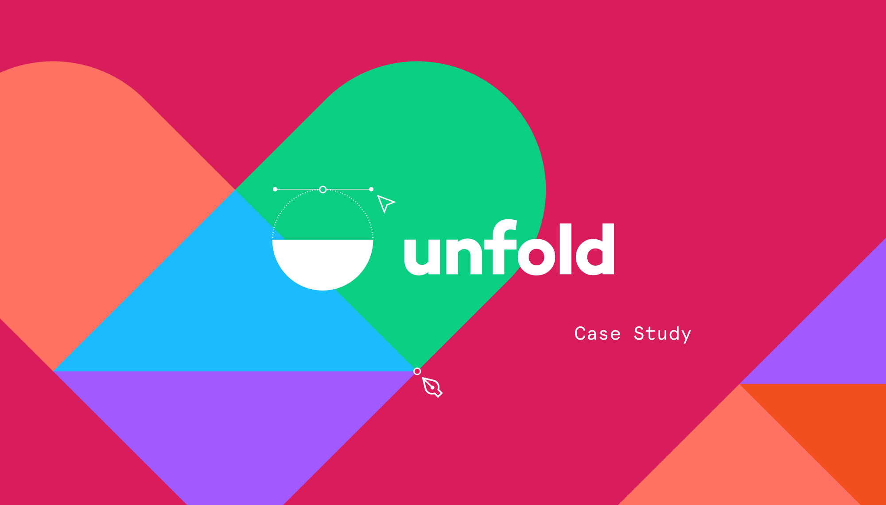
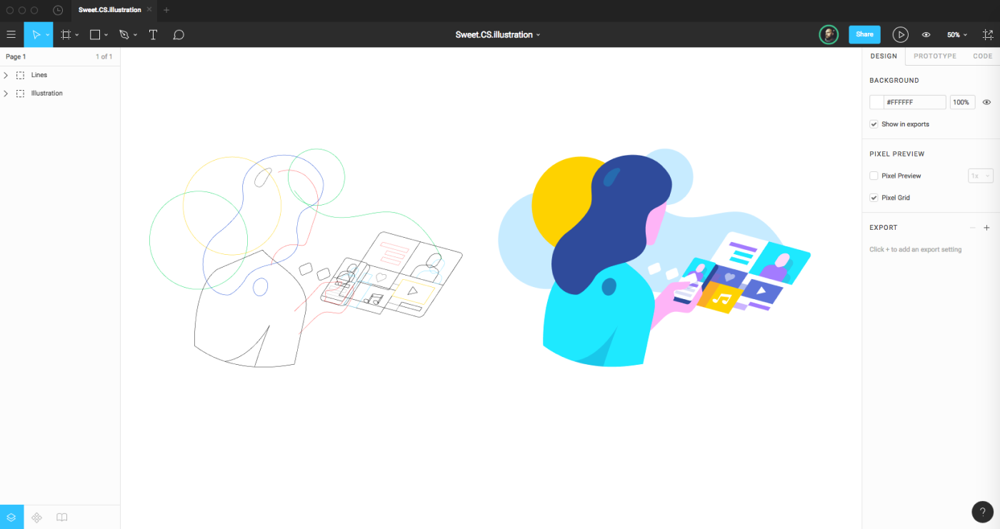
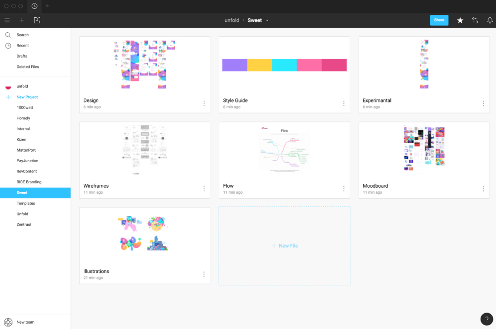
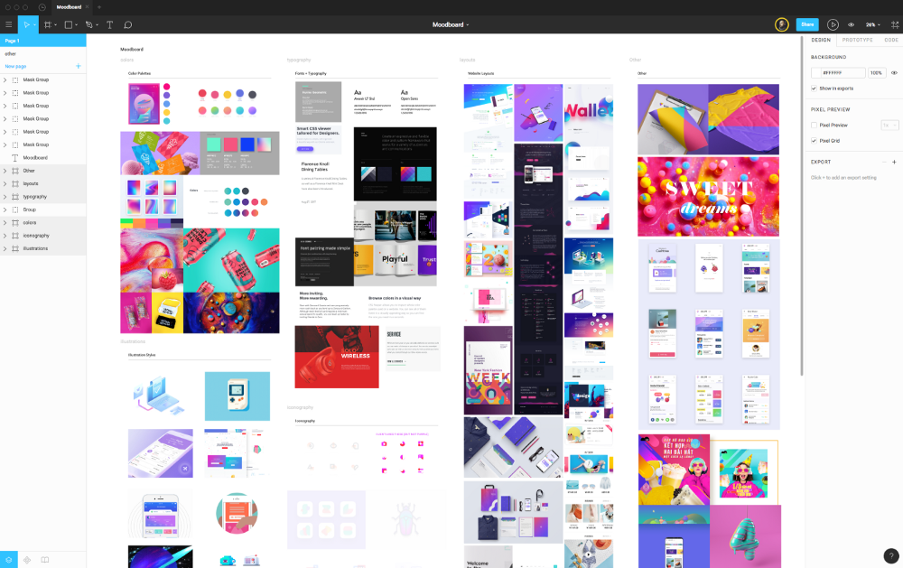

# 翻译003_时间就是金钱：Figma如何加速我们的工作流程的

2017年12月14日 · #翻译

作为设计师，我发现在做 Components Library 时能够获得极大的满足感，而在做一些类似画插画之类的事情时，就会烦恼不已，因为绘画能力实在不行，里边也包含着更多的不确定性。

Figma 上周有篇较火的文章，是一个案例学习，Figma 以采访者的角度，讲了一个 Figma 使用者的体验。Figma 是我非常热衷的一个界面设计工具，所以就想说翻译一下，为它的传播做一点微小的贡献。
为了方便阅读，文中的几个词，先在这里解释一下。

**Figma**：一个基于网页的多人协同界面设计工具。也许你没听说过 Figma，但你一定听过 Sketch。相比较之下，Fimga 的主要优势在于它有非常良心的免费基础版，跨平台，还有多人协同（几个人可以同时编辑同一个文件而不会冲突）。它还有其他的很好的特性，体验一下，相信你会爱上它。

**Unfold**：一个位于弗罗里达的设计工作室。也许你没有听说过 Unfold，但你可能听说过他们做的 Grabient，一个在 Product Hunt 上小有名气的应用，它是给设计师用来获取渐变颜色的灵感的工具。
下面进入译文。

* * *

> “客户表示很喜欢，我们也很喜欢。” ——Unfold 设计工作室；

一个设计工作室需要和各种各样的角色进行大量的合作：开发工程师、市场人员、设计师、销售人员还有项目经理，其中包含了自己工作室的成员和客户的团队。

在这样的环境中，协作的变得愈加复杂。这么多人参与在项目中，而且可能使用着不同的操作系统，还有杂七杂八的软件需要付费（也或许不需要），几乎没有办法分享和讨论最新的设计。

Unfold， 一个位于弗罗里达的，与 Squarespace 和 PayPal 之类的公司合作的10人设计工作室，太了解上面所说的烦恼了。“ 我发现，当有多个版本打开的时候，我们总是覆盖了彼此的版本，或者遇到文件冲突，那是真的烦。” Unfold的创始人Eddie Lobanovskiy回忆说。

为了解决这些问题，他们一起花了许多时间来尝试寻找解决问题的插件。但最终，Lobanovskiy 受够了，转而去寻找一个替代方案，并发现了Figma，一个集设计，原型设计和开发交接于一身的产品。因为 Figma 是运行在浏览器中的，所以只需要发送一个链接，团队成员就可以看到最新的设计稿，对设计稿进行评论，还有完成和开发的交接。无论任何人或是任何操作系统的电脑，只要有链接或是权限，就可以访问设计稿。

“我们简直爱死它了，” Lobanovskiy 说。“它立马解决了版本控制，协同工作还有收集反馈这些问题，从而腾出了大量的时间，而很明显时间就是金钱。”他估计 Figma 给 Unlold 至少节省了30%的用于沟通的时间。

## 在同一个地方搞定所有的事情

一旦团队成员决定了选择使用 Fimga，就不得不说服客户也做一下工具的转变了。Unfold 的大部分客户都没有听说过 Figma,但是Lobanovoskiy 说这并不是问题，他说：“当我告诉客户，我们所做的所有事情，都会在同一个工具平台上时，他们就很容易接受这个转变。”

Unfold 团队使用 Figma 的 Sketch 导入功能，来将现有客户的项目过渡过来，这样可以将你的 Sketch 设计文件直接带到 Figma。对于新的客户，团队利用了 Figma 可以多人同时协作的功能来进行头脑风暴。所有人一起在同一个文件里将灵感描绘出来。

> “它给我们腾出了大量的时间，而很明显时间就是金钱。”

“看到所有人同时在同一个地方把想法表达出来，实在是太神奇了，” Lobanovskiy 说。“客户表示很喜欢，我们也很喜欢。”这些是在他们发现Figma这个工具前，所不能做到的，因为现在市面上根本就没有一个设计工具可以让所有人同时在同一个文件里进行写作。

在进行最初的头脑风暴之后，Unfold 的设计师会开始完成 Moodboard 或者模板，然后加上色板，字体和视觉灵感。在以往，他们只能把图片保存在他们自己的电脑里，然后手动地上传到他们的原型工具中。

“在 Figma 里制作 Moodboard 会快很多，因为你只需要把网上的图片直接拖拽到你的 Fimga 文件中，” Lobanovskiy 说。“它非常即时——你只需要一直拖就行了，根本不需要等待。”

当 Unfold 团队在 Figma 中画了更高保真的设计时，每个人都可以通过一个相同的链接地址里访问到最新版本的设计。每个人都不需要总是进行导出和上传文件的操作，同时，客户也可以随时用 Figma 自带的评论工具留下他们的想法。Figma 的评论是固定在相应的画板上的，所以评论总是能跟设计稿结合起来，而不是分散到类似钉钉或邮箱之类的地方。

> “当我告诉客户我们所做的所有事情，都会同一个工具平台上时，他们就很容易接受这个转变。”

## 解决大麻烦——和开发交接

在过去的工作流程中，Unfold 最不喜欢的就是和开发交接的流程。“在使用 Figma 之前，我们客户的开发团队可能没有使用 Mac，所以经常在沟通的时候都很糟糕。” Lobanovskiy 回忆说。"我们不得不说服他们让他们做他们并不喜欢做的事，比如订阅一些相关的工具。"

为了避免这种情况，他们最终会把设计文件转换为 Psd 然后用 Ps 来打开，而这样也不可避免地会把图层弄得一团糟。 Lobanovskiy 说。“为了这个，我们得他们介绍十个新东西。” 而现在，我们只需要跟他们说，上 Figma 看吧。

Figma 的代码模式允许开发者直接导出资源图，还有获取 CSS，Android 和 iOS 代码。这些资源总是跟最新的设计保持同步——没有同步的必要——因为它也是 Figma 云平台的一部分。而且，开发者仅仅只需要查看权限就可以使用代码模式，这意味着客户和开发者都不用为 Figma 付费就可以完整地使用它。“因为 Figma 是跨平台的，所以你不用跟他们说 ‘你没有 Mac，所以你打不开那些文件，’这是一个巨大的优势。” Lobanovskiy 说，“因为这样，我们还得到了许多的称赞。”

## 时间就是客户

Lobanovskiy 说，最终，Figma 简化了 Unfold 的开发过程，帮助他们快速地完成项目，同时，它也减少了团队所需要面临的挑战。 Lobanovskiy 说，“即使 Figma 没有给我们节省时间，我们也会因为它所带来的工作流而很开心地去使用它。这就感觉像是，使用 Fimga 可以完成更多地工作一样。（笑）”

* * *

### 参考链接

1. [Figma](https://www.figma.com/)
2. [Unfold](http://www.unfold.co)
3. [Grabient](http://www.grabient.com)
4. [More time, more money: How Figma accelerates agency workflows](https://www.figma.com/blog/more-time-more-money-how-figma-accelerates-agency-workflow/)
