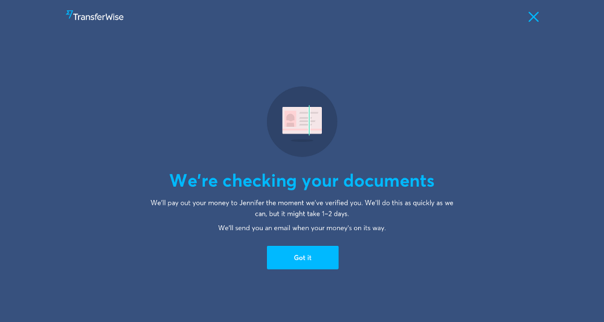
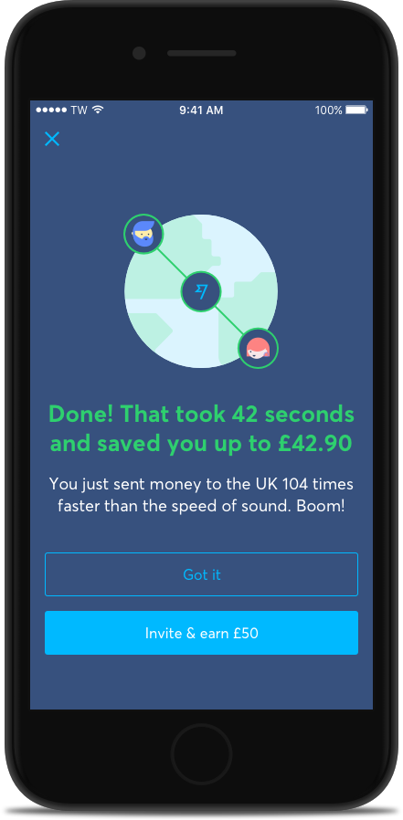
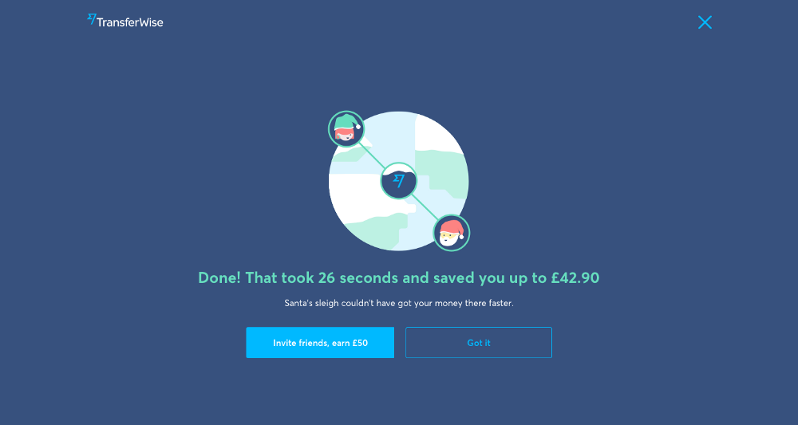

# 严肃的产品不必设计的那么严肃

2018年2月8日 · #翻译

> 文章翻译自 [Transferwise 的一篇博客文章](https://uxdesign.cc/serious-products-dont-have-to-be-serious-3c5aa7d0b42a)。
>
> 当大家都追求基础功能的完善，行业内的设计模式会趋同，比如电商行业的商品列表和商品详情的设计，许多公司的产品设计大同小异。颜色上的区别？元素间隔的区别？这篇文章告诉我们，当基础功能完善之后，还可以这么玩。

在类似金融服务这样的行业中，我们已经习惯了所有的交流都是正式的、严肃的，坦率地讲，是无聊的。任何形式的个性是非常罕见的景象，这是行业内部的共识。但其实不一定非要这样的。。。

在 TransferWise，我们最近推出了即时转账服务，让您可以在几秒钟内将钱从欧洲汇入英国，而不是几天。这向我们使钱能在全世界范围内的快速周转的使命迈了一大步。我们看待这件事的方式是，如果你可以把撸猫的视频在几秒钟内发送给你的朋友，那么你也应该可以用一样快的速度把钱发送给他们。

## 基础功能先于趣味性

从一开始，我们就知道我们希望通过即时转账的体验来取悦用户，即所谓的趣味性。但是在这之前，我们必须先把基础功能做对。

您可以像马斯洛的需求层次结构一样思考产品设计和开发。用户首先需要基础的东西。在马斯洛里，基础需求是食物、水和庇护所。对应到我们这边，就是解决一个真实用户的问题和建立一个可靠的服务。

在我们这个即时转账这个例子中，我们关注的基础功能包括：

- **解决一个真实客户的问题：** 用户并不能总是在需要的时候把钱发送给他们的收款人。无论是家庭紧急还是支付账单，人们的资金流向是按照公司的时间表来的，而不是他们自己的时间表。
- **让服务变得可靠：** 我们必须建立让用户能够立即把钱发送出去的“管道”。可靠性是通过处理的“即时转账”转账数量来衡量的。当这个可靠性的几率很大时，我们才能推出这个“即时功能”。这个可能对“后端”的要求更高，但它是建立一个伟大的用户体验的关键。
- **设计一个端到端的体验：** 我们着手设计清晰透明的端到端“即时转账”体验。我们希望用户能够清楚地知道他们什么时候能，什么时候不能即时发送。

为了设计一个基础而可用的体验，我们必须优雅地处理任何可能出错的情况。当确实出现了错误（而且会偶尔出现），那么这时就应该考虑功能性多余趣味性了。应该把重点放在让用户了解那里出了问题，下一步应该做什么。

例如，如果用户的帐户验证过程中，如果他们的转账不能立即处理。在这种情况下，我们必须清晰地表明接下来该怎么做。

> 当你可以做到超出用户预期时，你的目标是取悦你的用户。但是，当你偶尔不可避免地会失败时，要表现得谦逊些。

一旦你已经确定并且满足了你的基本产品需求时，你就可以去追求产品的趣味性了。这就是你可以把你的用户从客户变成品牌代言人的转折点了。

然而，如果你在产品的基础上就失败了，它将会变得不好用或者没有用处。在这个点上尝试追求趣味性可能会适得其反。它可能会让用户觉得你一开始就关注错误的东西。

## 为趣味性腾出空间

通过用户研究，我们发现即时转账最大的好处之一就是它能给用户内心的平静。用户不休要在反复确认转账到账了没有、或者是担心什么时候才能到账。这有助于减少他们的精神负担。

除此之外，人们目前对国际货币转账的期望值非常低。银行和其他供应商通常需要几天才能将资金转移到国际上。这也是他们高昂的价格和隐藏的费用。

通过超越用户的预期，减少他们的焦虑，我们才有了创造趣味的机会。我们用有趣的动画和巧妙的文案，在一个严肃的行业中传递了乐趣。

## 动效

动画设计用来指导用户完成转账中的每一步操作。例如，当从欧洲向英国转账时，用户会看到:

- 他们的钱到达了 TransferWise 的欧洲账户
- TransferWise 检查他们转账有没有为，例如检查有没有欺诈
- 他们的钱从 TransferWise 的英国账户转到他们的收款人手中

所有的动画场景都被设计到一个单独的文件中，以确保平稳过渡，最小化开发的工作量和减小文件大小。里边包括了所有的边缘情况，例如验证。这个动画最初是在 After Effects 中设计的，然后使用 Bodymovin 工具导出为 Json 文件。这个文件随后通过 Lottie 使用在Web、iOS 和 Anroid 项目中 。这些神奇的工具可以让动画按照设计者的意愿来实现，而且开发时间也很少。最后，为了获得理想中的体验，开发人员可以完全控制它的播放、暂停、循环、调整速度、缩放等等。

## 文案

我们想通过文案来创造一种令人愉悦的体验。在转账成功的之后，我们会向用户展示一个随机的“速度传输速度情况”文案。传输速度是根据粗略的发送和接收位置计算的。然后我们将他们的转账速度和一些速度进行比较，比如猎豹速度、音速。

这个即时体验是经过多次迭代设计的，并且经过了彻底的用户测试。在一个接一个用户使用之后，我们定性地见证了一次有趣的体验带来的好处。无论是通过笑声，还是积极的评价，这种即时体验的趣味性因素都是通过用户来完成的。

## 复活节彩蛋

我们不想就此止步。我们想通过在使用流程中添加一些小小的 UI 彩蛋，传播一些节日的快乐气氛。复活节彩蛋是你的产品中的一个惊喜，让你的用户感到惊喜。不需要添加功能，但是，这种小彩蛋可以让你的产品在功能性之外具有趣味性。

在12月25日之前，我们将用一些更有节日气氛的东西来替代我们的插图、动画和文案。我们的复活节彩蛋可能不像在谷歌上输入“askew”那样高级，但我们希望它能让我们的用户高兴。

## 有趣的产品带来的好处

在产品中传递趣味性比实际看起来的更有好处。动画和小文案可以用来教育你的用户。就像在学校一样，最令人难忘的课堂总是最有趣的。

在这个产品中，我们希望实现以下几点:

- 建立我们的产品擅长什么的认知。在TransferWise，转账速度是我们关键的“产品支柱”之一。这也是我们的客户选择我们的原因之一。通过使用动画和文案，我们传达了一种我们产品的转账速度是有多快的认知。

- 建立一个连贯的、TransferWise是如何运作的心理模型。通过第三方提供商向国际市场转账可能会让人感到困惑。我们经常发现用户困惑于为什么他们需要将钱转到TransferWise，而不是直接转给收款人。这个动画的目的是为了强化他们的资金流动的心理模型。这只是我们在产品中教育用户的地方之一。要坚持使用，彻底地加强这种心智模型——不要在你的产品的单一位置建立心里模型。

## 有趣的产品才是符合人性的产品

总的来说，新的即时转账体验的基础是解决一个真正的客户问题。允许客户按照他们的时间来转账，而不是我们的时间。但我们想要做得更好一些，在产品创造一种令人愉悦的体验。

在像金融服务这样的行业里，公司很少考虑设计的趣味性。他们的产品基础功能是他们的首要任务。但很少有公司像超越这一点，创造令客户愉悦的体验。设计好基础功能能能让你得到用户，而设计好趣味性能让用户成为你品牌的拥护者。

通过即时转账，我们希望为金融服务带来一种更有趣的、更人性化的体验。提醒我们的客户，除了这种把钱在世界范围内流通的高级技术之外，还真的有人在为他们解决问题。
