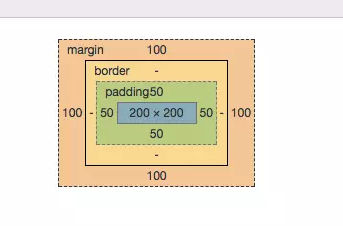

# Day 002：padding & margin
> Date:  2019.5.21
> By dorryLiu 
> [返回 README](README.md)  

## 1.根据设计稿利用margin或padding调整所有布局的位置,如图所示

关于margin：
1. 属于一个盒子的外边距,不会改变盒子本身的大小;
2. 书写方式：margin-top:10px;margin-left:10px;margin-right:10px;margin-bottom:10px;
3. 简写方式：margin:上 右 下 左；
   > 说明：  
   > (1)如果上边距==下边距 并且 左边距==右边距
   > 可以写成：margin:10px 5px;
   > 表示margin-top:10px; margin-bottom:10px;margin-left:5px;margin-right:5px;
   > (2)如果上边距==下边距==左边距==右边距
   > 可以写成：margin:10px;
   > 表示margin-top:10px; margin-bottom:10px;margin-left:10px;margin-right:10px;

关于padding:
2.属于一个盒子的内边距,会改变盒子本身的大小；
书写方式和规则与margin完全一致，只需要将margin替换成padding

margin & padding结构图示如下：

